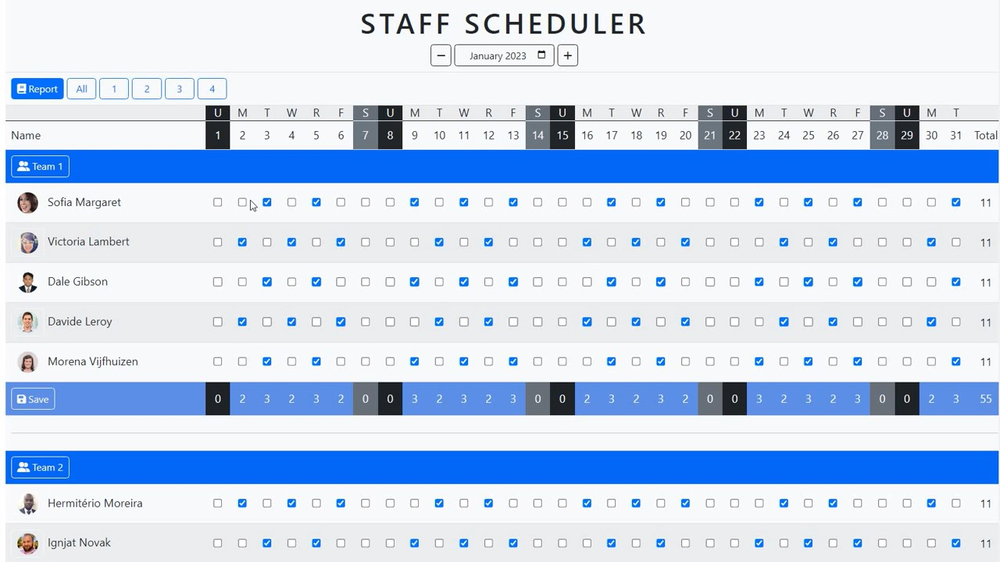
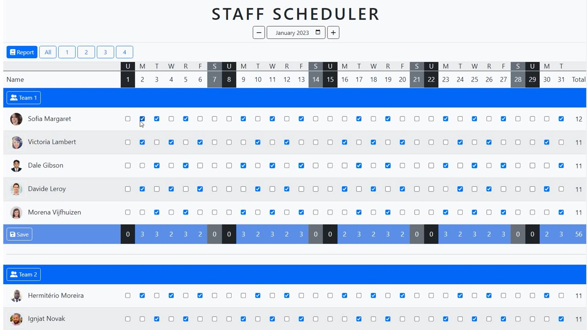
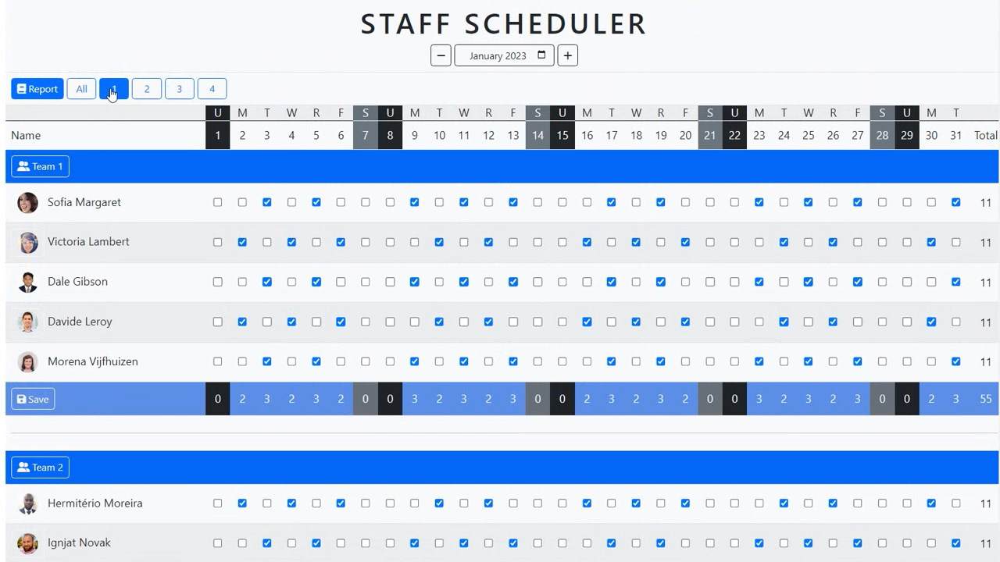
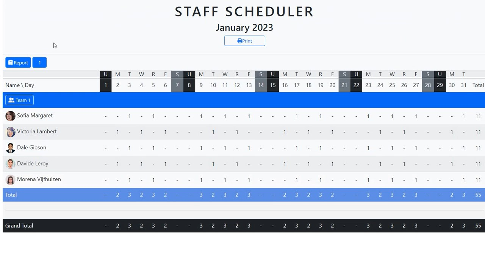
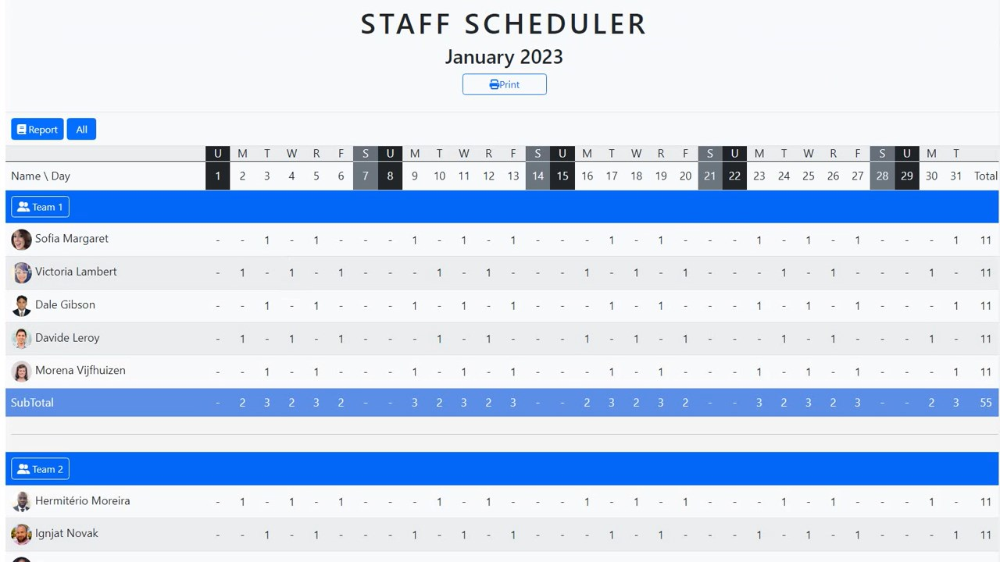
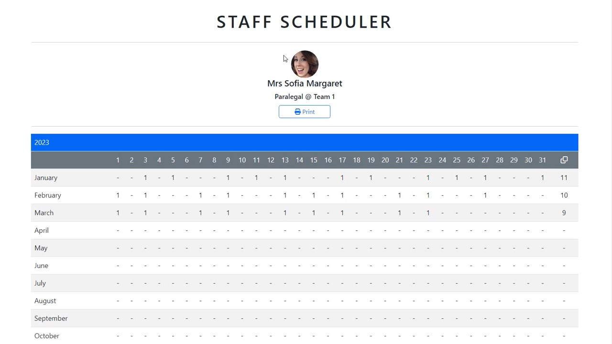

## Staff Scheduler 
:arrow_right: Preview

### Introduction

In 2021, my organization was affected by the COVID-19 pandemic and implemented work-from-home measures. This caused difficulty for my supervisor in generating accurate reports for staff schedules and assignments. I used Excel VBA macros to create a tool that automated the process and ensured data accuracy, saving my supervisor up to 90% of the time spent on report preparation. I am now using a new framework to build a similar tool to share with others.

<p align="center"><br>
<i>1.1 Overview of Staff Scheduler</i></p>

> Note: The user data is extracted from [https://randomuser.me/](https://randomuser.me/) and the names and pictures are not real.

#### Getting started
These instructions will get you a copy of the project up and running on your local machine for development and testing purposes.

#### Prerequisites
Python 3.10 or later
Additional packages: 
- dotenv
- ejs
- express
- express-ejs-layouts
- mongoose
- nodemon

> Note: The packages* are installed for future enhancement

1. **Clone** the repository for your reference
```
git clone https://github.com/cwchan0212/self-staff-scheduler.git
```
2. **Navigate** to the project directory and copy the files according to the following file structures. 
```
cd self-staff-scheduler
```
3. **Install** the packages
```
npm install
```

### File Structure
```
public/
├─ css/
│  ├─ style.css
├─ images/
│  ├─ favicon.ico
├─ js/
│  ├─ script.js
server/
├─ controllers/
│  ├─ staffController.js
├─ models/
│  ├─ database.js
│  ├─ Staff.js
├─ routes/
│  ├─ staffRoutes.js
views/
├─ layouts/
│  ├─ main.ejs
├─ index.ejs
├─ report.ejs
├─ staff.ejs
.env
.gitignore
package-lock.json
package.json
README.MD
server.js
```
### Usage
1. Start the development server
```
npm start
```
2. Open a web browser and navigate to http://localhost:3000/
3. **Tick** the dates of the staff attendance 
4. View **reports** - all teams, specified team or staff


**Tick** the dates of staff attendance
The user clicks the checkbox to update the attendance records of the staff, and the total counts of the column and row are then changed. After clicking the **SAVE** button, the attendance records will be updated in the database.

> Note: The attendance records are subject to the database and the changes will not be accurate unless the user saves the changes to the database.

<p align="center"><br>
<i>1.2 The total counts of the column and row are changed after checked</i></p>


**View** reports - All / Teams / Individual
It allows users to view the attendance report of all teams, specific teams, and individuals.

<p align="center"><br>
<i>1.3 The user clicks all or specific teams to view the reports</i></p>

<p align="center"><br>
<i>1.4 The attendance report of all teams </i></p>

<p align="center"><br>
<i>1.5 The attendance report of specific team </i></p>

By clicking the buttons All or team number, the user will get the attendance report of all teams or specific teams. When the user clicks the **thumbnail** of the staff, he will view the attendance report of the individual.

<p align="center"><br>
<i>1.6 The user clicks the thumbnail to view the individual's report </i></p>

<p align="center"><br>
<i>1.7 The attendance report of specific the individial</i></p>

### Summary

The Staff Scheduler application is designed to automate the process of creating schedules for **hybrid work arrangements**. It can also be used for other purposes such as creating **duty rosters**, **tracking attendance** and managing **leaves**. The application allows staff to easily check their schedules and see when they are expected to be in the office. It can be adapted to different settings and organizations, and it allows to save time, and increase efficiency and accuracy.